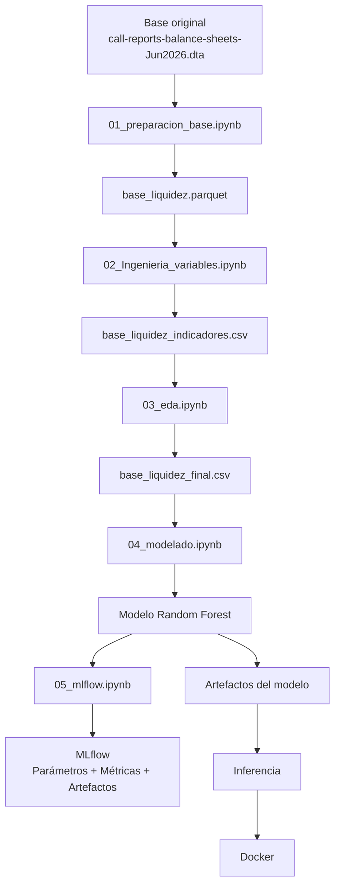

# LiquiditySense

### Modelo de Machine Learning para la detección temprana del deterioro de liquidez bancaria


---

## 1. Descripción del proyecto

**LiquiditySense** es un proyecto de Machine Learning desarrollado en el marco del Curso II de la Especialización en **Machine Learning Engineering**, cuyo objetivo es construir un modelo supervisado capaz de identificar de manera anticipada situaciones asociadas con un **deterioro de la posición de liquidez de una entidad bancaria**.

El proyecto utiliza información histórica de estados financieros y balances bancarios observados a nivel de entidad y período, a partir de la cual se construye un conjunto de indicadores financieros, estructurales y dinámicos relacionados con la liquidez.

La solución integra un flujo completo de Machine Learning Engineering:

* preparación y validación de datos;
* ingeniería de variables;
* análisis exploratorio de datos (EDA);
* construcción de la variable objetivo;
* control de leakage;
* división temporal de los datos;
* preprocesamiento;
* entrenamiento y comparación de modelos;
* optimización del modelo;
* evaluación sobre datos no utilizados durante el entrenamiento;
* interpretación de variables;
* tracking de experimentos mediante MLflow;
* almacenamiento de artefactos del modelo;
* inferencia;
* contenerización mediante Docker;
* documentación técnica;
* versionado mediante Git y GitHub.

El resultado final es un modelo **Random Forest optimizado**, orientado a funcionar como una herramienta de **alerta temprana y priorización de entidades**, y no como un mecanismo automático de decisión financiera.

---

# 2. Problema de Machine Learning

## 2.1 Problema de negocio

La liquidez constituye uno de los elementos fundamentales para la estabilidad financiera de una entidad bancaria, debido a que una reducción significativa de sus activos líquidos respecto de su tamaño puede incrementar su vulnerabilidad ante necesidades de fondeo, retiros de depósitos u otros eventos de tensión.

El análisis exclusivamente retrospectivo permite identificar que una entidad ya experimentó un deterioro, pero no necesariamente permite priorizar anticipadamente qué observaciones presentan una mayor probabilidad de deterioro futuro.

Por esta razón, el proyecto plantea la utilización de Machine Learning para transformar información financiera histórica en una herramienta de **detección temprana de señales de deterioro de liquidez**.

---

## 2.2 Formulación del problema

El problema se plantea como una tarea de **clasificación binaria supervisada**.

Para cada entidad bancaria y período se busca estimar:

> **¿La entidad presentará un deterioro significativo de su posición de liquidez en el siguiente período?**

El modelo genera una probabilidad:

```text
P(deterioro de liquidez futuro | información financiera disponible)
```

Posteriormente, dicha probabilidad puede transformarse en una clasificación binaria utilizando un umbral de decisión.

---

## 2.3 Objetivo general

Desarrollar y validar un modelo de Machine Learning capaz de identificar anticipadamente observaciones bancarias con mayor probabilidad de experimentar un deterioro significativo de liquidez en el siguiente período.

---

## 2.4 Objetivos específicos

1. Preparar y validar una base histórica de información bancaria.
2. Construir indicadores financieros asociados con la posición de liquidez.
3. Incorporar variables de crecimiento interanual y trimestral.
4. Identificar y controlar posibles problemas de calidad de datos.
5. Construir una variable objetivo basada en el deterioro futuro de la liquidez.
6. Evitar leakage mediante una separación temporal adecuada.
7. Comparar diferentes algoritmos de clasificación.
8. Optimizar el modelo seleccionado.
9. Evaluar el desempeño sobre un conjunto Test no utilizado durante el entrenamiento.
10. Identificar las variables con mayor importancia dentro del modelo.
11. Registrar parámetros, métricas y artefactos mediante MLflow.
12. Validar la inferencia del modelo y su ejecución dentro de Docker.
13. Documentar y versionar el proyecto siguiendo buenas prácticas de Machine Learning Engineering.

---

# 3. Hipótesis

La hipótesis de trabajo es:

> **La información financiera histórica, complementada con indicadores de liquidez, estructura financiera y variaciones temporales, contiene información suficiente para identificar patrones asociados con un deterioro futuro de la posición de liquidez bancaria.**

En particular, se plantea que variables relacionadas con:

* disponibilidad de activos líquidos;
* relación entre activos líquidos y depósitos;
* composición de los depósitos;
* crecimiento de activos líquidos;
* crecimiento de depósitos;
* crecimiento de cartera;
* estructura de pasivos;
* capitalización;
* calidad de cartera;

pueden aportar información predictiva para anticipar situaciones de deterioro.

---

# 4. Tipo de problema

| Característica           | Definición                                                |
| ------------------------ | --------------------------------------------------------- |
| Tipo de Machine Learning | Supervisado                                               |
| Tipo de problema         | Clasificación binaria                                     |
| Unidad de observación    | Entidad bancaria – período                                |
| Variable objetivo        | Deterioro futuro de liquidez                              |
| Horizonte                | Siguiente período disponible                              |
| Modelos evaluados        | Random Forest, XGBoost, HistGradientBoosting, Extra Trees |
| Modelo seleccionado      | Random Forest                                             |
| Métrica principal        | ROC-AUC                                                   |
| Métricas complementarias | Accuracy, Precision, Recall, F1                           |
| Uso previsto             | Alerta temprana y priorización                            |
| Umbral final             | 0.50                                                      |

---

# 5. Flujo general del proyecto

El proyecto se desarrolla mediante un pipeline reproducible compuesto por cinco notebooks principales.



---

# 6. Estructura del pipeline de datos

El procesamiento se divide en etapas independientes para facilitar la trazabilidad.

```text
BASE ORIGINAL
      │
      ▼
01_preparacion_base.ipynb
      │
      ▼
base_liquidez.parquet
      │
      ▼
02_Ingenieria_variables.ipynb
      │
      ▼
base_liquidez_indicadores.csv
      │
      ▼
03_eda.ipynb
      │
      ▼
base_liquidez_final.csv
      │
      ▼
04_modelado.ipynb
      │
      ▼
05_mlflow.ipynb
```

Esta separación permite distinguir claramente:

* preparación de datos;
* ingeniería de variables;
* análisis exploratorio;
* modelado;
* tracking y validación experimental.

---

# 7. Dataset

## 7.1 Fuente y formato

La base original utilizada corresponde al archivo:

```text
call-reports-balance-sheets-Jun2026.dta
```

Formato:

```text
STATA (.dta)
```

La base original contiene aproximadamente:

```text
2,557,391 registros
194 variables
```

Debido al tamaño de la fuente original y con el objetivo de desarrollar un pipeline eficiente, se realizó una selección inicial de variables relevantes para el problema.

---

## 7.2 Selección inicial

Se seleccionaron **21 variables originales** relacionadas con:

* identificación de entidades;
* fecha;
* activos;
* efectivo;
* valores negociables;
* depósitos;
* cartera;
* calidad de cartera;
* pasivos;
* patrimonio;
* deuda subordinada.

Las variables seleccionadas fueron:

```text
id_rssd
date
assets
cash
securities
deposits
demand_deposits
time_deposits
brokered_dep
insured_deposits
ln_tot
ln_tot_gross
ln_re
ln_ci
ln_cons
ln_agr
ln_rre
npl_tot
liab_tot
equity
subdebt
```

---

# 8. Preparación y calidad de datos

La etapa de preparación incluyó:

1. Selección de variables relevantes.
2. Conversión y validación de fechas.
3. Restricción temporal al período 2000–2025.
4. Ordenamiento por entidad y fecha.
5. Revisión de duplicados por entidad-período.
6. Identificación de valores nulos.
7. Identificación de valores infinitos.
8. Revisión de variables financieras.
9. Identificación de registros estructuralmente incompletos.
10. Almacenamiento de la base intermedia en formato Parquet.

La base inicial procesada mantuvo:

```text
2,557,391 registros
21 variables
```

Posteriormente se construyeron las variables de ingeniería.

---

# 9. Ingeniería de variables

La ingeniería de variables constituye una de las principales etapas del proyecto.

Se construyeron indicadores de cuatro tipos principales:

1. Indicadores financieros.
2. Ratios de liquidez y estructura.
3. Crecimientos temporales.
4. Indicadores de ausencia estructural de información.

---

## 9.1 Activos líquidos

Se definió:

```text
liquid_assets = cash + securities
```

Esta variable representa una aproximación al volumen de recursos financieros inmediatamente disponibles o de mayor liquidez.

---

## 9.2 Indicadores de liquidez

Entre los principales ratios construidos se encuentran:

| Variable                    | Interpretación                                |
| --------------------------- | --------------------------------------------- |
| `liquidez_inmediata`        | Activos líquidos respecto de depósitos        |
| `cash_deposits`             | Efectivo respecto de depósitos                |
| `securities_deposits`       | Valores respecto de depósitos                 |
| `loan_deposit`              | Cartera respecto de depósitos                 |
| `loan_assets`               | Cartera respecto de activos                   |
| `deposits_assets`           | Depósitos respecto de activos                 |
| `brokered_deposits_ratio`   | Depósitos intermediados respecto de depósitos |
| `insured_deposits_ratio`    | Depósitos asegurados respecto de depósitos    |
| `time_deposits_ratio`       | Depósitos a plazo respecto de depósitos       |
| `demand_deposits_ratio`     | Depósitos a la vista respecto de depósitos    |
| `leverage_ratio`            | Pasivos respecto de activos                   |
| `liquid_assets_liabilities` | Activos líquidos respecto de pasivos          |
| `capital_assets_ratio`      | Patrimonio respecto de activos                |
| `npl_ratio`                 | Cartera deteriorada respecto de cartera       |
| `liquid_assets_assets`      | Activos líquidos respecto de activos          |
| `time_deposits_assets`      | Depósitos a plazo respecto de activos         |
| `demand_deposits_assets`    | Depósitos a la vista respecto de activos      |
| `loans_liquid_assets`       | Cartera respecto de activos líquidos          |

---

# 10. Variables dinámicas

Para capturar cambios en el comportamiento financiero de las entidades se construyeron variables de crecimiento.

## 10.1 Crecimiento interanual

Se utilizaron variaciones de cuatro períodos para aproximar el crecimiento interanual:

```text
loan_growth_yoy
deposit_growth_yoy
cash_growth_yoy
securities_growth_yoy
liabilities_growth_yoy
assets_growth_yoy
liquid_assets_growth_yoy
```

---

## 10.2 Crecimiento trimestral

También se construyeron variaciones respecto del período inmediatamente anterior:

```text
deposit_growth_qoq
cash_growth_qoq
liquid_assets_growth_qoq
loan_growth_qoq
liabilities_growth_qoq
assets_growth_qoq
securities_growth_qoq
equity_growth_qoq
```

Estas variables permiten incorporar información sobre cambios recientes en la estructura financiera.

---

# 11. Tratamiento de información faltante

Los valores faltantes no fueron tratados automáticamente como errores.

Se distinguieron diferentes situaciones:

* ausencia de información;
* falta estructural por disponibilidad histórica;
* denominadores iguales a cero;
* primeras observaciones necesarias para calcular variaciones temporales;
* registros completamente incompletos.

Para conservar información sobre la estructura de los datos se generaron indicadores de ausencia estructural.

Entre ellos:

```text
faltante_estructural_yoy
faltante_estructural_qoq
loan_growth_yoy_faltante_estructural
deposit_growth_yoy_faltante_estructural
cash_growth_yoy_faltante_estructural
securities_growth_yoy_faltante_estructural
liabilities_growth_yoy_faltante_estructural
assets_growth_yoy_faltante_estructural
liquid_assets_growth_yoy_faltante_estructural
deposit_growth_qoq_faltante_estructural
cash_growth_qoq_faltante_estructural
liquid_assets_growth_qoq_faltante_estructural
loan_growth_qoq_faltante_estructural
liabilities_growth_qoq_faltante_estructural
assets_growth_qoq_faltante_estructural
securities_growth_qoq_faltante_estructural
equity_growth_qoq_faltante_estructural
```

Los valores infinitos generados por operaciones matemáticas fueron reemplazados por valores nulos antes del modelado.

---

# 12. Análisis Exploratorio de Datos — EDA

El notebook:

```text
03_eda.ipynb
```

realiza el análisis exploratorio y control de calidad de la base.

Se analizaron:

* dimensiones de la base;
* distribución de variables;
* estadísticos descriptivos;
* valores faltantes;
* valores infinitos;
* correlaciones;
* posibles valores extremos;
* comportamiento temporal;
* comportamiento de indicadores de liquidez;
* consistencia de los registros por entidad;
* calidad de los indicadores construidos.

Como parte del control final se identificaron y eliminaron únicamente **3 registros completamente incompletos en las variables financieras originales**.

La base final utilizada para modelado quedó conformada por:

```text
698,181 registros
11,339 entidades bancarias
88 variables
```

---

# 13. Variable objetivo

La variable objetivo se construyó a partir de la evolución de:

```text
liquid_assets_assets
```

definida como:

```text
Activos líquidos / Activos totales
```

Primero se calculó la variación respecto al período anterior:

```text
cambio_liquidez_qoq =
(liquidez_actual - liquidez_anterior) / liquidez_anterior
```

Posteriormente se definió el umbral de deterioro utilizando el percentil 10 de dicha distribución.

El umbral obtenido en la ejecución final fue:

```text
-0.131448
```

Por lo tanto, una observación se considera como deterioro cuando la variación de liquidez se encuentra por debajo o igual a dicho umbral.

La variable objetivo final se desplaza un período hacia adelante para que el modelo utilice información disponible en el período actual para anticipar el deterioro del siguiente período.

Conceptualmente:

```text
Información financiera en t
          │
          ▼
      MODELO
          │
          ▼
Probabilidad de deterioro en t+1
```

---

# 14. Distribución de la variable objetivo

Después de construir la variable objetivo:

|               Clase | Descripción  |    Registros | Participación |
| ------------------: | ------------ | -----------: | ------------: |
|                   0 | No deterioro |      629,527 |      90.1667% |
|                   1 | Deterioro    |       68,654 |       9.8333% |
| **Total modelable** |              | **698,181*** |               |

* Para el entrenamiento se eliminan las observaciones cuyo target futuro no está disponible.

La base efectiva utilizada para modelado quedó en:

```text
686,842 registros
```

con:

```text
11,339 observaciones con target no disponible
```

correspondientes principalmente a la última observación temporal de cada entidad.

La distribución muestra un **desbalance de clases**, por lo que se utilizaron estrategias específicas durante el entrenamiento.

---

# 15. Prevención de Data Leakage

La prevención de leakage fue considerada como un componente crítico del diseño.

Las variables directamente relacionadas con la construcción del target no fueron utilizadas como predictores.

Se excluyeron:

```text
liquidez_anterior
cambio_liquidez_qoq
deterioro_liquidez
target
```

También se excluyeron las variables auxiliares utilizadas exclusivamente como denominadores.

No se utilizaron:

```text
id_rssd
date
```

como variables predictoras.

La variable temporal:

```text
periodo_banco
```

sí se incorporó como predictor temporal.

---

# 16. Variables predictoras finales

El conjunto final contiene:

```text
71 variables predictoras
```

distribuidas de la siguiente manera:

| Grupo                               | Cantidad |
| ----------------------------------- | -------: |
| Variables financieras               |       20 |
| Ratios financieros                  |       18 |
| Crecimientos interanuales           |        7 |
| Crecimientos trimestrales           |        8 |
| Indicadores de ausencia estructural |       17 |
| Variable temporal                   |        1 |
| **Total**                           |   **71** |

---

# 17. División Train / Validation / Test

Debido a la naturaleza temporal del problema, no se utilizó una división aleatoria tradicional.

Se realizó una división temporal para evitar utilizar información futura durante el entrenamiento.

La distribución final fue:

| Dataset    |   Registros |
| ---------- | ----------: |
| Train      |     597,931 |
| Validation |      38,769 |
| Test       |      50,142 |
| **Total**  | **686,842** |

El conjunto Test permaneció separado hasta la evaluación final.

---

# 18. Preprocesamiento

El preprocesamiento se realizó mediante un pipeline reproducible basado en `scikit-learn`.

Para las variables numéricas se utilizaron:

```text
SimpleImputer(strategy="median")
        ↓
RobustScaler()
```

El uso de `RobustScaler` permite reducir la influencia de valores extremos en la transformación de las variables.

El preprocesador fue ajustado **exclusivamente con el conjunto Train**.

Posteriormente se aplicó la transformación sobre Validation y Test.

Dimensiones resultantes:

```text
Train:
(597931, 71)

Validation:
(38769, 71)

Test:
(50142, 71)
```

Se verificó que después del preprocesamiento no existieran valores faltantes ni infinitos.

---

# 19. Algoritmos evaluados

Como parte del proceso de selección se evaluaron cuatro algoritmos:

1. Random Forest.
2. HistGradientBoosting.
3. XGBoost.
4. Extra Trees.

La comparación se realizó utilizando el conjunto Test.

---

# 20. Comparación de modelos

| Modelo               |     Test AUC |     Accuracy |    Precision |   Recall |           F1 |
| -------------------- | -----------: | -----------: | -----------: | -------: | -----------: |
| **Random Forest**    | **0.812740** |     0.777113 |     0.218003 | 0.661733 | **0.327962** |
| HistGradientBoosting |     0.805323 | **0.917993** | **0.547368** | 0.012618 |     0.024668 |
| XGBoost              |     0.801908 |     0.838459 |     0.249086 | 0.479253 |     0.327801 |
| Extra Trees          |     0.718064 |     0.705058 |     0.158995 | 0.603494 |     0.251682 |

Aunque algunos modelos presentaron una Accuracy superior, esta métrica por sí sola no resulta suficiente debido al desbalance existente entre las clases.

El **Random Forest** mostró un equilibrio favorable entre capacidad de discriminación y detección de la clase minoritaria.

Por esta razón se seleccionó como modelo candidato para optimización.

---

# 21. Optimización del Random Forest

Se evaluaron diferentes configuraciones sobre el conjunto Validation.

| Configuración | n_estimators | max_depth | min_samples_leaf | Validation AUC |    Precision |       Recall |           F1 |
| ------------- | -----------: | --------: | ---------------: | -------------: | -----------: | -----------: | -----------: |
| RF 1          |          300 |        10 |               20 |       0.772334 |     0.245768 |     0.578755 |     0.345022 |
| RF 2          |          300 |        12 |               20 |       0.776543 |     0.251667 |     0.550559 |     0.345432 |
| RF 3          |          400 |        10 |               30 |       0.771662 |     0.244364 |     0.592854 |     0.346080 |
| **RF 4**      |      **400** |    **12** |           **30** |   **0.775659** | **0.251017** | **0.570005** | **0.348543** |

La configuración seleccionada fue la cuarta, debido a que presentó el **mayor F1 sobre Validation** entre las configuraciones evaluadas.

Es importante señalar que la configuración seleccionada **no fue elegida por tener el mayor AUC**, sino por presentar el mejor equilibrio entre Precision y Recall medido mediante F1.

---

# 22. Modelo final

El modelo definitivo corresponde a:

```text
RandomForestClassifier
```

con la siguiente configuración:

```python
n_estimators = 400
max_depth = 12
min_samples_leaf = 30
max_features = "sqrt"
class_weight = "balanced"
random_state = 42
n_jobs = -1
```

El parámetro:

```text
class_weight = balanced
```

permite compensar el desbalance existente entre las clases.

---

# 23. Umbral de clasificación

La probabilidad generada por el modelo se transforma en una clasificación binaria utilizando:

```text
Threshold = 0.50
```

La interpretación es:

```text
P(deterioro) >= 0.50
        ↓
Predicción = 1
```

y:

```text
P(deterioro) < 0.50
        ↓
Predicción = 0
```

El threshold debe entenderse como un parámetro operativo que puede ser revisado dependiendo del objetivo de utilización del modelo.

---

# 24. Evaluación final sobre Test

La evaluación final del modelo se realizó sobre un conjunto Test separado del proceso de entrenamiento y selección.

Resultados obtenidos:

| Métrica     |    Resultado |
| ----------- | -----------: |
| **ROC-AUC** | **0.815599** |
| Accuracy    |     0.786486 |
| Precision   |     0.224408 |
| Recall      | **0.650570** |
| F1          |     0.333707 |

---

# 25. Interpretación de resultados

El resultado:

```text
ROC-AUC = 0.815599
```

indica una capacidad de discriminación adecuada para diferenciar entre observaciones con y sin deterioro futuro dentro del conjunto de evaluación.

El:

```text
Recall = 0.650570
```

significa que el modelo identifica aproximadamente el **65.1% de los casos positivos** del conjunto Test utilizando el umbral de 0.50.

La:

```text
Precision = 0.224408
```

muestra que una proporción importante de las observaciones clasificadas como deterioro no corresponde finalmente a un evento positivo según la definición utilizada.

Por tanto, el modelo debe interpretarse principalmente como una **herramienta de alerta temprana y priorización**, donde resulta relevante detectar una proporción significativa de potenciales deterioros, en lugar de utilizar la predicción como una decisión automática.

---

# 26. Matriz de confusión

Con el threshold de 0.50 se obtuvo:

```text
[[40067, 5954],
 [ 2146, 1975]]
```

Interpretación:

|        | Predicción 0 | Predicción 1 |
| ------ | -----------: | -----------: |
| Real 0 |       40,067 |        5,954 |
| Real 1 |        2,146 |        1,975 |

El modelo logró identificar:

```text
1,975 casos positivos correctamente
```

mientras que:

```text
2,146 casos positivos
```

no fueron detectados.

Esta información es especialmente relevante para un sistema de alerta temprana, debido a que permite analizar explícitamente el costo relativo de falsos negativos y falsos positivos.

---

# 27. Interpretabilidad del modelo

Para interpretar el modelo se utilizó la importancia de variables proporcionada por el algoritmo Random Forest mediante:

```text
feature_importances_
```

Las cinco variables con mayor importancia fueron:

| Ranking | Variable                   | Importancia |
| ------: | -------------------------- | ----------: |
|       1 | `securities_deposits`      |    0.115846 |
|       2 | `liquid_assets_growth_qoq` |    0.077443 |
|       3 | `securities`               |    0.068727 |
|       4 | `cash_deposits`            |    0.054504 |
|       5 | `liquid_assets_assets`     |    0.050865 |

En conjunto, estas cinco variables representan aproximadamente:

```text
36.74%
```

de la importancia total estimada por el modelo.

La presencia de variables relacionadas con valores negociables, efectivo y activos líquidos es consistente con el objetivo del proyecto, ya que dichas variables capturan diferentes dimensiones de la posición de liquidez.

**Importante:** la importancia de variables no debe interpretarse como causalidad. Indica contribución relativa dentro del modelo, no que una variable por sí misma provoque el deterioro.

---

# 28. MLflow

El seguimiento de experimentos se implementó mediante **MLflow** utilizando una base SQLite local.

Experimento:

```text
LiquiditySense
```

El tracking permite registrar:

* parámetros;
* métricas;
* tags;
* artefactos;
* información del Run.

---

## 28.1 Parámetros registrados

El Run correspondiente al modelo definitivo contiene:

```text
n_estimators = 400
max_depth = 12
min_samples_leaf = 30
max_features = sqrt
class_weight = balanced
random_state = 42
```

---

## 28.2 Métricas registradas

El Run final contiene:

```text
auc_test = 0.815599
accuracy_test = 0.786486
precision_test = 0.224408
recall_test = 0.650570
f1_test = 0.333707
```

Estas métricas fueron verificadas directamente contra los resultados finales obtenidos durante el entrenamiento.

---

## 28.3 Artefactos registrados

MLflow registra los tres componentes necesarios para reproducir la inferencia:

```text
model
preprocessor
variables
```

Correspondientes a:

```text
model
    ↓
Random Forest entrenado

preprocessor
    ↓
Transformaciones utilizadas durante entrenamiento

variables
    ↓
Lista de variables predictoras finales
```

---

# 29. Validación de MLflow

El notebook:

```text
05_mlflow.ipynb
```

realiza una validación independiente del experimento registrado.

La validación comprueba:

1. existencia del experimento;
2. existencia de Runs;
3. identificación del Run definitivo;
4. parámetros del modelo;
5. métricas Test;
6. artefactos registrados;
7. consistencia entre la configuración esperada y la registrada.

El experimento quedó validado correctamente.

---

# 30. Modelo productivo e inferencia

El proyecto incorpora los artefactos necesarios para realizar inferencia:

```text
random_forest_liquidez.pkl
preprocesador_liquidez.pkl
variables_modelo.pkl
```

La inferencia se realiza mediante el script:

```text
scripts/predict.py
```

El proceso de inferencia:

```text
Registro bancario
      ↓
Validación de variables
      ↓
Carga del preprocesador
      ↓
Transformación
      ↓
Carga del Random Forest
      ↓
Predicción de probabilidad
      ↓
Aplicación del threshold
      ↓
Resultado
```

Durante la validación final se obtuvo un ejemplo de inferencia con:

```text
Probabilidad de deterioro: 0.582300
Threshold: 0.50
Predicción: 1
```

La inferencia fue ejecutada correctamente utilizando los artefactos finales.

---

# 31. Evaluación online

El proyecto no implementa dentro de su alcance una API REST desplegada públicamente ni un servicio online de inferencia con tráfico real.

Por lo tanto:

> **No se reportan métricas de desempeño online ni métricas de servicio en producción real, ya que no existe un endpoint productivo con observaciones nuevas en operación.**

En su lugar, se realizó una **validación de inferencia del modelo productivo**, verificando que:

* el modelo pueda cargarse;
* el preprocesador pueda cargarse;
* las variables esperadas estén disponibles;
* la transformación pueda ejecutarse;
* la predicción pueda generarse;
* el resultado pueda validarse.

Esta distinción se mantiene explícitamente para evitar presentar como métricas online resultados obtenidos offline.

---

# 32. Docker

El proyecto incorpora un `Dockerfile` para empaquetar el entorno de ejecución.

La imagen utilizada durante la validación fue:

```text
liquiditysense:1.0.0
```

El contenedor incluye:

* Python;
* código fuente;
* notebooks;
* modelos;
* preprocesador;
* variables del modelo;
* reportes;
* documentación.

La ejecución dentro de Docker permitió validar la disponibilidad de los artefactos y realizar inferencia dentro de un entorno aislado.

---

# 33. Estructura del repositorio

```text
LiquiditySense/
│
├── data/
│   ├── raw/
│   └── processed/
│
├── models/
│   ├── random_forest_liquidez.pkl
│   ├── preprocesador_liquidez.pkl
│   └── variables_modelo.pkl
│
├── notebooks/
│   ├── 01_preparacion_base.ipynb
│   ├── 02_Ingenieria_variables.ipynb
│   ├── 03_eda.ipynb
│   ├── 04_modelado.ipynb
│   └── 05_mlflow.ipynb
│
├── reports/
│
├── scripts/
│   ├── preprocess.py
│   ├── train.py
│   └── predict.py
│
├── src/
│   └── liquiditysense/
│       ├── data.py
│       ├── features.py
│       ├── preprocessing.py
│       ├── modeling.py
│       ├── evaluation.py
│       └── tracking.py
│
├── tests/
│
├── .dockerignore
├── .gitignore
├── Dockerfile
├── README.md
├── pyproject.toml
├── mlflow.db
└── uv.lock
```

---

# 34. Descripción de módulos

## `src/liquiditysense/data.py`

Responsable de:

* carga de datos;
* lectura de archivos `.dta`;
* lectura de Parquet;
* lectura de CSV;
* validaciones iniciales;
* definición de variables base.

---

## `src/liquiditysense/features.py`

Contiene la lógica reutilizable para:

* indicadores de liquidez;
* ratios financieros;
* crecimiento interanual;
* crecimiento trimestral;
* indicadores de ausencia estructural;
* tratamiento de valores infinitos.

---

## `src/liquiditysense/preprocessing.py`

Contiene:

* identificación de variables predictoras;
* exclusión de variables con leakage;
* construcción del preprocesador;
* imputación;
* escalamiento;
* validaciones del resultado transformado.

---

## `src/liquiditysense/modeling.py`

Contiene:

* creación de modelos;
* comparación de algoritmos;
* optimización del Random Forest;
* entrenamiento;
* extracción de importancia de variables.

---

## `src/liquiditysense/evaluation.py`

Contiene:

* cálculo de métricas;
* clasificación por threshold;
* evaluación;
* matriz de confusión;
* reportes de clasificación;
* análisis de umbrales.

---

## `src/liquiditysense/tracking.py`

Centraliza las operaciones relacionadas con MLflow:

* configuración del tracking URI;
* creación/obtención del experimento;
* registro de parámetros;
* registro de métricas;
* registro de artefactos;
* tags del experimento.

---

# 35. Scripts de ejecución

El proyecto incluye tres scripts principales.

## 35.1 Preprocesamiento

```bash
python scripts/preprocess.py
```

Construye la base procesada a partir de la información original.

---

## 35.2 Entrenamiento

```bash
python scripts/train.py
```

Realiza:

1. carga de la base final;
2. construcción del target;
3. identificación de predictores;
4. división temporal;
5. preprocesamiento;
6. entrenamiento del Random Forest;
7. evaluación;
8. almacenamiento de artefactos;
9. registro del experimento en MLflow.

---

## 35.3 Inferencia

```bash
python scripts/predict.py
```

Carga los artefactos finales y ejecuta una predicción sobre un registro de la base.

---

# 36. Notebooks

## `01_preparacion_base.ipynb`

Preparación de la fuente original y generación de la base de trabajo.

Salida:

```text
data/processed/base_liquidez.parquet
```

---

## `02_Ingenieria_variables.ipynb`

Construcción de indicadores financieros y variables dinámicas.

Salida:

```text
data/processed/base_liquidez_indicadores.csv
```

---

## `03_eda.ipynb`

Análisis exploratorio, calidad de datos y generación de la base final.

Salida:

```text
data/processed/base_liquidez_final.csv
```

---

## `04_modelado.ipynb`

Incluye:

* construcción del target;
* selección de predictores;
* división temporal;
* preprocesamiento;
* comparación de modelos;
* optimización;
* entrenamiento final;
* evaluación;
* interpretabilidad;
* almacenamiento de artefactos.

---

## `05_mlflow.ipynb`

Incluye la validación del experimento registrado en MLflow:

* Runs;
* parámetros;
* métricas;
* artefactos;
* consistencia del modelo final.

---

# 37. Diccionario de datos

## 37.1 Variables originales principales

| Variable           | Descripción                         | Tipo     | Categoría      |
| ------------------ | ----------------------------------- | -------- | -------------- |
| `id_rssd`          | Identificador de la entidad         | Entero   | Identificación |
| `date`             | Fecha de observación                | Fecha    | Temporal       |
| `assets`           | Activos totales                     | Numérico | Financiera     |
| `cash`             | Efectivo y disponibilidades         | Numérico | Liquidez       |
| `securities`       | Valores / títulos                   | Numérico | Liquidez       |
| `deposits`         | Depósitos totales                   | Numérico | Fondeo         |
| `demand_deposits`  | Depósitos a la vista                | Numérico | Fondeo         |
| `time_deposits`    | Depósitos a plazo                   | Numérico | Fondeo         |
| `brokered_dep`     | Depósitos intermediados             | Numérico | Fondeo         |
| `insured_deposits` | Depósitos asegurados                | Numérico | Fondeo         |
| `ln_tot`           | Cartera total                       | Numérico | Crédito        |
| `ln_tot_gross`     | Cartera total bruta                 | Numérico | Crédito        |
| `ln_re`            | Exposición inmobiliaria             | Numérico | Crédito        |
| `ln_ci`            | Exposición comercial/industrial     | Numérico | Crédito        |
| `ln_cons`          | Exposición de consumo               | Numérico | Crédito        |
| `ln_agr`           | Exposición agropecuaria             | Numérico | Crédito        |
| `ln_rre`           | Exposición inmobiliaria residencial | Numérico | Crédito        |
| `npl_tot`          | Cartera deteriorada / NPL           | Numérico | Calidad        |
| `liab_tot`         | Pasivos totales                     | Numérico | Solvencia      |
| `equity`           | Patrimonio                          | Numérico | Capital        |
| `subdebt`          | Deuda subordinada                   | Numérico | Capital/Fondeo |

---

## 37.2 Variables derivadas

Las variables derivadas se agrupan en:

### Liquidez

```text
liquid_assets
liquidez_inmediata
cash_deposits
securities_deposits
liquid_assets_liabilities
liquid_assets_assets
loans_liquid_assets
```

### Estructura financiera

```text
loan_deposit
loan_assets
deposits_assets
brokered_deposits_ratio
insured_deposits_ratio
time_deposits_ratio
demand_deposits_ratio
leverage_ratio
capital_assets_ratio
npl_ratio
time_deposits_assets
demand_deposits_assets
```

### Crecimiento interanual

```text
loan_growth_yoy
deposit_growth_yoy
cash_growth_yoy
securities_growth_yoy
liabilities_growth_yoy
assets_growth_yoy
liquid_assets_growth_yoy
```

### Crecimiento trimestral

```text
deposit_growth_qoq
cash_growth_qoq
liquid_assets_growth_qoq
loan_growth_qoq
liabilities_growth_qoq
assets_growth_qoq
securities_growth_qoq
equity_growth_qoq
```

### Variables estructurales

Las variables con el sufijo:

```text
_faltante_estructural
```

identifican situaciones en las cuales la información necesaria para calcular determinados indicadores dinámicos no se encuentra disponible debido a la estructura temporal de los datos.

---

# 38. Model Card

## Model Details

**Nombre:** LiquiditySense Random Forest

**Versión:** v1.0.0

**Tipo:** Clasificación binaria supervisada

**Algoritmo:** Random Forest

**Variables:** 71

**Threshold:** 0.50

---

## Intended Use

El modelo está destinado a:

* análisis exploratorio;
* monitoreo;
* generación de alertas tempranas;
* priorización de entidades;
* apoyo al análisis de riesgo de liquidez.

No está diseñado para:

* automatizar decisiones financieras;
* sustituir el análisis experto;
* determinar por sí solo la solvencia de una entidad;
* generar decisiones regulatorias automáticas;
* utilizarse fuera del contexto para el cual fue desarrollado sin una nueva validación.

---

## Performance

```text
ROC-AUC:   0.815599
Accuracy:  0.786486
Precision: 0.224408
Recall:    0.650570
F1:        0.333707
```

---

## Training Data

La base corresponde a observaciones históricas de entidades bancarias entre:

```text
2000 – 2025
```

La unidad de análisis es:

```text
Entidad bancaria × período
```

---

## Limitaciones

Entre las principales limitaciones se encuentran:

1. La definición del target depende del umbral estadístico seleccionado.
2. El modelo identifica asociaciones predictivas y no relaciones causales.
3. La distribución de datos puede cambiar en períodos futuros.
4. La precisión es relativamente limitada debido al desbalance y naturaleza del problema.
5. El modelo requiere monitoreo periódico.
6. Las condiciones macrofinancieras futuras pueden diferir significativamente del período histórico.
7. El modelo no incorpora información externa que no se encuentre en la base utilizada.
8. No existe actualmente un servicio REST productivo con métricas online.
9. Antes de utilizar el modelo en un entorno operativo real debe realizarse una validación adicional sobre datos recientes y bajo el marco de gobierno correspondiente.

---

# 39. Consideraciones sobre desbalance

La clase positiva representa aproximadamente el 9.8% de las observaciones modelables.

Por este motivo, Accuracy no se utiliza como única métrica de selección.

Se consideran conjuntamente:

```text
ROC-AUC
Precision
Recall
F1
```

La utilización de:

```text
class_weight = "balanced"
```

permite otorgar mayor importancia a la clase minoritaria durante el entrenamiento.

---

# 40. Reproducibilidad

La reproducibilidad se controla mediante:

```text
random_state = 42
```

y mediante el almacenamiento de:

```text
modelo
preprocesador
variables predictoras
```

Además, los parámetros del modelo definitivo se registran en MLflow.

La separación entre datos, transformación, entrenamiento y evaluación permite reproducir cada etapa del pipeline.

---

# 41. Gestión de artefactos

Los principales artefactos generados por el proyecto son:

```text
models/
├── random_forest_liquidez.pkl
├── preprocesador_liquidez.pkl
└── variables_modelo.pkl
```

Estos artefactos permiten separar:

```text
Modelo
+
Preprocesamiento
+
Especificación de variables
```

evitando depender únicamente del notebook para ejecutar inferencias.

---

# 42. Git Strategy

El proyecto adopta una estrategia basada en **GitHub Flow**, adaptada a una estructura con rama principal y rama de desarrollo.

Las ramas principales son:

```text
main
development
```

### `main`

Contiene versiones estables del proyecto destinadas a entregas y releases.

### `development`

Contiene el desarrollo activo antes de ser incorporado a `main`.

El flujo general es:

```text
development
      │
      ▼
Desarrollo / correcciones
      │
      ▼
Commit
      │
      ▼
Pull Request
      │
      ▼
Revisión
      │
      ▼
Merge
      │
      ▼
main
      │
      ▼
Release
```

---

# 43. Pull Requests

Las modificaciones relevantes se integran mediante Pull Requests.

El proyecto debe conservar evidencia de al menos un Pull Request correctamente cerrado entre:

```text
development → main
```

Esto permite demostrar:

* control de cambios;
* revisión;
* integración;
* trazabilidad;
* utilización de ramas.

---

# 44. Versionado

El proyecto utiliza versionado semántico:

```text
MAJOR.MINOR.PATCH
```

La versión de entrega corresponde a:

```text
v1.0.0
```

Esta versión representa la primera versión estable del proyecto con:

* pipeline de datos;
* ingeniería de variables;
* EDA;
* modelo entrenado;
* evaluación;
* MLflow;
* artefactos;
* inferencia;
* Docker;
* documentación.

---

# 45. Release v1.0.0

## LiquiditySense v1.0.0

### Incluye

* Pipeline de preparación de datos.
* Ingeniería de variables de liquidez.
* EDA.
* Construcción del target.
* Control de leakage.
* División temporal.
* Preprocesamiento.
* Comparación de cuatro algoritmos.
* Optimización de Random Forest.
* Modelo final.
* Evaluación Test.
* Interpretabilidad.
* Tracking con MLflow.
* Artefactos del modelo.
* Script de entrenamiento.
* Script de inferencia.
* Dockerfile.
* Documentación técnica.

### Modelo final

```text
RandomForestClassifier
```

### Test AUC

```text
0.815599
```

### Test Recall

```text
0.650570
```

### Test F1

```text
0.333707
```

---

# 46. Buenas prácticas implementadas

El proyecto incorpora las siguientes prácticas de Machine Learning Engineering:

* separación entre notebooks y código reusable;
* modularización del código;
* control de leakage;
* división temporal;
* preprocesamiento reproducible;
* manejo explícito de valores faltantes;
* control de infinitos;
* comparación de modelos;
* selección basada en Validation;
* evaluación final sobre Test;
* almacenamiento de artefactos;
* tracking con MLflow;
* inferencia mediante script;
* contenerización;
* control de versiones;
* documentación técnica.

---

# 47. Limitaciones técnicas del proyecto

El proyecto corresponde a una primera versión:

```text
v1.0.0
```

Por lo tanto, existen oportunidades de mejora.

Entre ellas:

1. Incorporación de nuevas fuentes de información.
2. Incorporación de variables macroeconómicas.
3. Evaluación mediante backtesting más extensivo.
4. Monitoreo de drift.
5. Calibración probabilística.
6. Optimización del threshold según costos de error.
7. Implementación de API REST.
8. Monitoreo online.
9. Automatización del pipeline.
10. Integración con un sistema de model registry.
11. Evaluación periódica de estabilidad.
12. Incorporación de técnicas adicionales de explicabilidad.

Estas mejoras corresponden a una posible evolución posterior del proyecto.

---

# 48. Conclusiones

El proyecto **LiquiditySense** demuestra la viabilidad de utilizar Machine Learning para desarrollar una herramienta de detección temprana de deterioro de liquidez a partir de información financiera histórica.

La construcción del modelo requirió integrar diferentes etapas de un ciclo completo de Machine Learning Engineering, comenzando con la preparación de una base histórica de gran tamaño y continuando con la construcción de indicadores financieros, análisis exploratorio, definición del target, control de leakage, modelado y evaluación.

La comparación de cuatro algoritmos permitió seleccionar Random Forest como la alternativa más conveniente para el objetivo planteado. Posteriormente, la optimización de hiperparámetros permitió obtener una configuración definitiva con:

```text
400 árboles
profundidad máxima = 12
mínimo de observaciones por hoja = 30
max_features = sqrt
class_weight = balanced
```

Sobre el conjunto Test, el modelo alcanzó:

```text
ROC-AUC = 0.815599
Recall   = 0.650570
F1       = 0.333707
```

El resultado muestra una capacidad razonable para diferenciar observaciones con y sin deterioro futuro y, especialmente, para identificar una proporción relevante de los eventos positivos.

Sin embargo, la precisión relativamente baja confirma que el modelo debe ser utilizado como **mecanismo de alerta y priorización**, y no como una herramienta automática de decisión.

Desde la perspectiva de Machine Learning Engineering, el proyecto también incorpora componentes fundamentales de industrialización, incluyendo modularización, scripts reproducibles, almacenamiento de artefactos, MLflow, inferencia y Docker.

En consecuencia, **LiquiditySense v1.0.0 constituye una primera implementación reproducible de un sistema de Machine Learning orientado a alerta temprana de liquidez bancaria**, dejando una base técnica para futuras versiones que incorporen monitoreo, nuevas fuentes de información, variables macroeconómicas, calibración, APIs y evaluación en producción.

---

# 49. Próximas mejoras

Como roadmap futuro se plantea:

```text
v1.0.0
│
├── Modelo inicial
├── MLflow
├── Docker
├── Inferencia
└── Documentación
        │
        ▼
v1.1.0
│
├── Nuevas variables
├── Variables macroeconómicas
└── Mejoras de calibración
        │
        ▼
v1.2.0
│
├── API REST
├── Monitoreo
└── Evaluación online
        │
        ▼
v2.0.0
│
├── Automatización
├── Model Registry
├── Drift Monitoring
└── Pipeline productivo
```

---

# 50. Estado final del proyecto

| Componente              | Estado |
| ----------------------- | :----: |
| Preparación de datos    |    ✅   |
| Ingeniería de variables |    ✅   |
| EDA                     |    ✅   |
| Construcción del target |    ✅   |
| Control de leakage      |    ✅   |
| División temporal       |    ✅   |
| Preprocesamiento        |    ✅   |
| Comparación de modelos  |    ✅   |
| Optimización            |    ✅   |
| Modelo final            |    ✅   |
| Evaluación Test         |    ✅   |
| Interpretabilidad       |    ✅   |
| MLflow                  |    ✅   |
| Artefactos              |    ✅   |
| Inferencia              |    ✅   |
| Docker                  |    ✅   |
| Código reusable         |    ✅   |
| Scripts                 |    ✅   |
| Documentación           |    ✅   |
| Model Card              |    ✅   |
| Git Strategy            |    ✅   |
| Release v1.0.0          |    ✅   |
| Pull Request cerrado    |    ✅   |

---

# 51. Autor

**Edwin Carlo Santos**

Proyecto desarrollado para:

**Especialización en Machine Learning Engineering — Curso II**

Proyecto:

**LiquiditySense**

Versión:

```text
v1.0.0
```

---

## Licencia

Este proyecto se desarrolla con fines académicos y de demostración técnica dentro del marco de la Especialización en Machine Learning Engineering.
